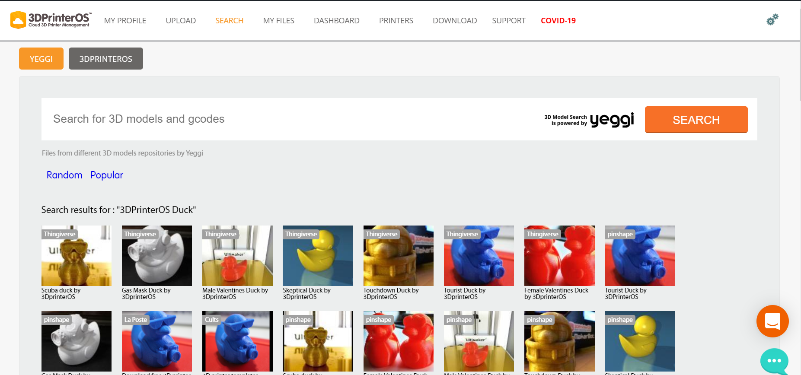
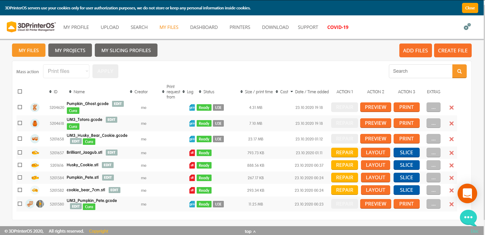
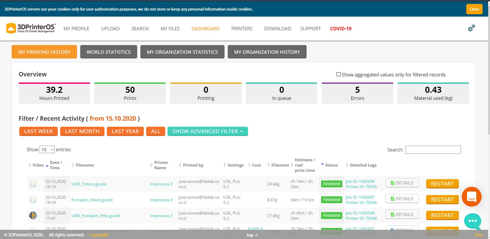
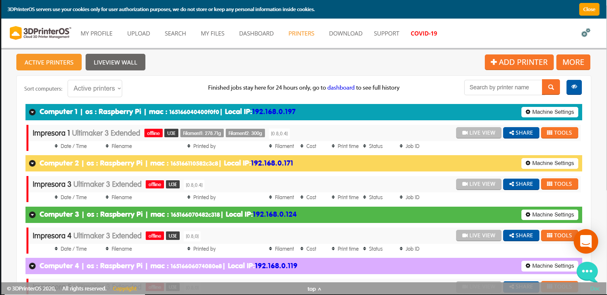
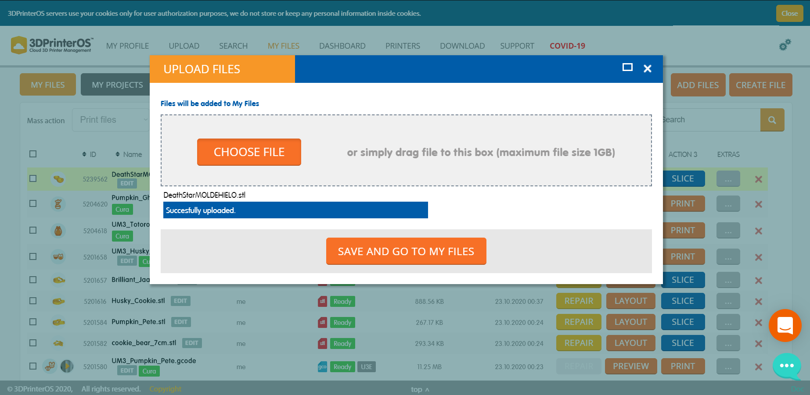
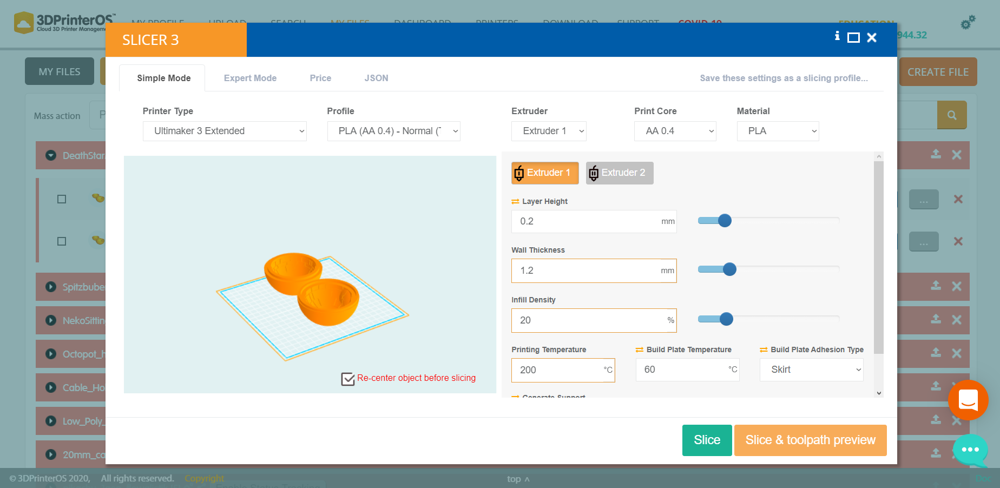
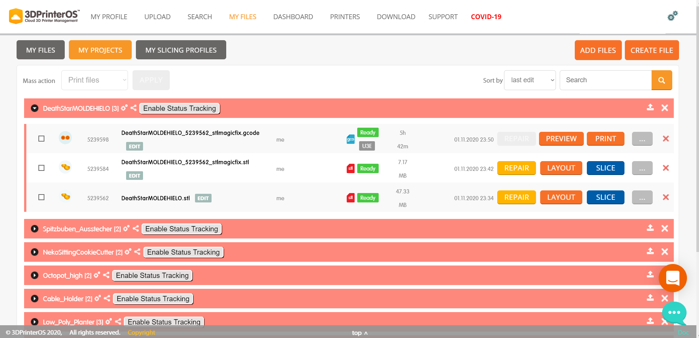

# Uso de plataforma 3Dprinteros
_La plataforma de 3Dprinteros nos permite cargar archivos, editar los parámetros de impresión y supervisar la operación de las impresoras 3d de Fablab en tiempo real, esto puede realizarse con múltiples dispositivos como computadores, Tablet, e incluso smartphones. En este tutorial mostraremos los pasos a seguir para usar la plataforma de 3Dprinteros._

## La plataforma
### LOGIN

_Para iniciar sesión se debe ingresar a la página https://cloud.3dprinteros.com/ e ingresar el mail y la contraseña, respetando las mayúsculas._

_Ya dentro de la sesión aparecerán las siguientes pestañas._

### UPLOAD
_Esta pestaña permite subir archivos .stl para luego poder preparar el archivo de impresión.La opción Single file te permite subir un archivo para crear un nuevo proyecto, en cambio la opción Project permite añadir archivos a un proyecto existente._

_Para subir un archivo se debe seleccionar la opción CHOOSE FILE la cual dependiendo del dispositivo que uses abrirá una ventana para buscar el archivo que deseas subir._

### SEARCH
_Esta pestaña permite buscar archivos .stl en páginas como Thingiverse, YouMagine, Cults, etc. para luego cargarlos e imprimirlos._ 

### MYFILES
_En esta pestaña aparecen los archivos que has sido subidos a la plataforma. Desde esta pestaña es posible ver los archivos, generar los Gcode y enviar un impresión._

### DASHBOARD 
_Esta pestaña nos muestra información sobre las impresiones realizadas como por ejemplo el número y horas de impresión, errores, cantidad de material utilizado, etc._

### PRINTERS
_Esta pestaña muestra cada una de las impresoras y su estatus, además permite ver la cámara en tiempo real de cada impresora._

## Pasos a seguir para mandar una impresión 

### Cargar un archivo
_Para cargar un archivo se debe ir a la pestaña UPLOAD y seleccionar Single file si se va a subir un archivo para un nuevo proyecto o seleccionar la opción Project si el archivo que se subirá es parte de un proyecto existente._ 

_Tras haber seleccionado una de las opciones se debe dar clic en la opción CHOOSE FILE la cual dependiendo del dispositivo que uses abrirá una ventana para buscar el archivo que deseas subir, en este caso trabajaremos con el archivo “DeathStarMOLDEHIELO.stl”._

_Luego de que se haya subido el archivo se debe seleccionar la opción SAVE AND GO TO MY FILES_

_Ya habiendo subido el archivo hay que ir a la pestaña MY FILES donde aparecerá el archivo, en este caso “DeathStarMOLDEHIELO.stl” el cual hemos subrayado en amarillo._

_El siguiente paso es seleccionar la opción REPAIR y se abrirá la siguiente ventana en donde se debe seleccionar la opción FIX._

_Tras el proceso anterior ahora nuestro archivo aparecerá en la sección MY PROJECTS donde debemos seleccionar la opción SLICE en el archivo nuevo, en este caso “DeathStarMOLDEHIELO_5239562_stlmagicfix.stl”._   

_Luego de seleccionar la opción de SLICE se abrirá una ventana en la cual se deben ajustar los parámetros de impresión. Luego se debe seleccionar una de las 2 opciones de SLICE, es recomendable usar la opción de SLICE & toolpath preview ya que permite ver como se generara el soporte y las capas de la impresión._

_Luego del SLICE se generará el archivo Gcode, el cual aparecerá en la sección de MY PROJECT._

_Ahora se debe seleccionar la opción PRINT y se abrirá una ventana donde se deben seleccionar alguna impresora disponible_

_Luego de esto se abrirá una ventana en la que se podrá ver el trabajo en tiempo real de la impresora, además se podrá pausar y cancelar la impresión de ser necesario._

